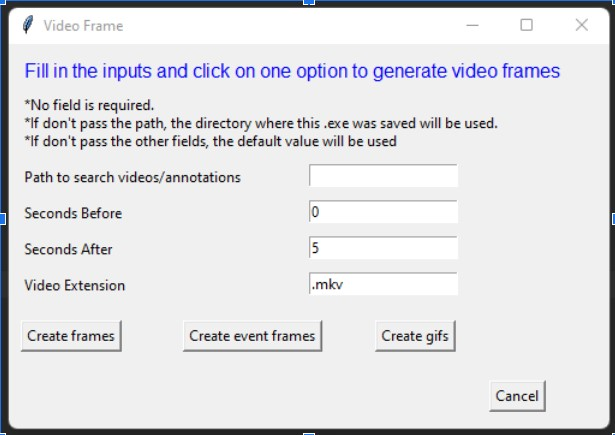
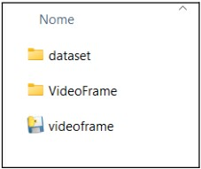
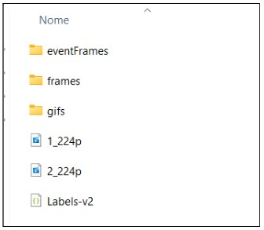
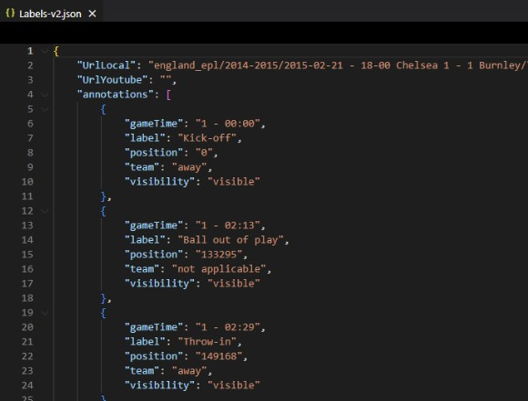

# VideoFrame
Create frames and short videos

This code was developed for the Final Programming Project of the master's degree ate PUC-Rio.

The goal is to split videos into frames, generate short videos of important parts and create frames of important moments. These important moments must be noted in .json files.
The project code and executable are available for download here.

### Assumptions:
- .json files must have the annotations tag and proper formatting;
- The code or the executable must be saved on the user's computer in the directory above the folder or folders containing the video and .json files.
- Otherwise, the user must inform the folder that contains the dataset.

### Technologies:
- Python;
- OpenCv;
- Unittest;
- Tkinter;
- PyInstaller.

### Needed packages:
- pip install opencv-python
- pip install pyinstaller

### Interface image:

### Directory structure:
    

### Json file structure

